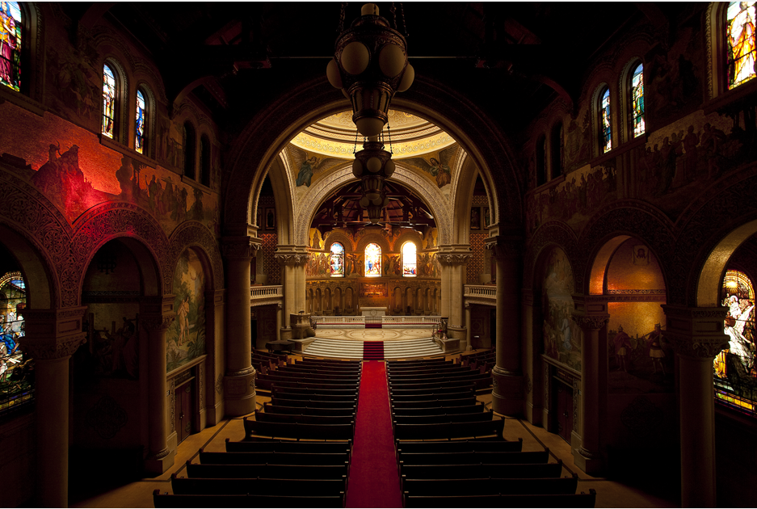
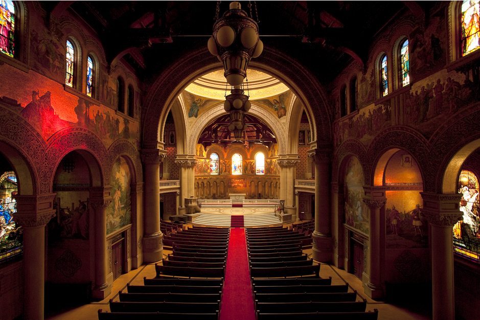

## Description

Based on the paper [*Adaptive Logarithmic Mapping For Displaying High
Contrast Scenes*](http://resources.mpi-inf.mpg.de/tmo/logmap/logmap.pdf)

The algorithm is used for computer displays to accurately output lighting information when compared to the human visual system.

## Outputs
Original Image

Output Image

